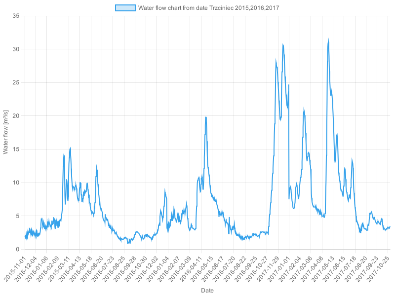
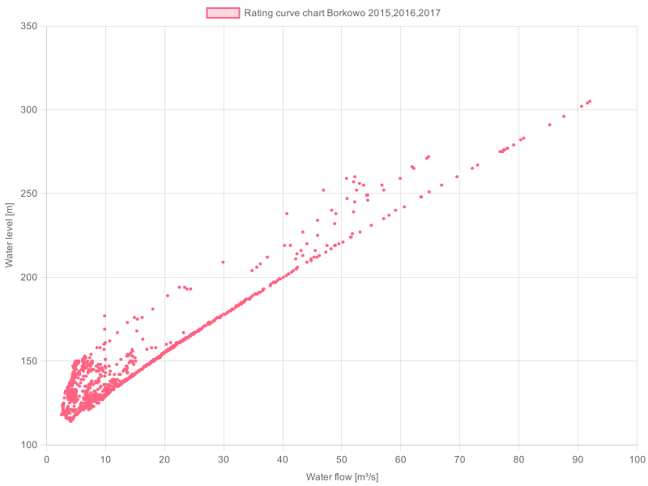

# RiverScrapper - fetching and processing data about rivers from IMGW

RiverScrapper is a program used to download and analyze hydrological data related to Polish rivers from the Institute of Meteorology and Water Management (IMGW). The program allows for generating charts of water level, flow rate, and flow intensity curve.

## Todo List

- [x] Downloading data from IMGW
- [x] Downloading selected rivers to separate files
- [x] Charts of water level from a date for each year
- [x] Charts of flow rate from a date for each year
- [x] Rating curve chart for each year
- [x] Charts of water level from a date for all years
- [x] Charts of flow rate from a date for all years
- [x] Rating curve chart for all years
- [x] Deleting downloaded files

## Charts

### Water Level Chart from Date

A chart showing the change in water level for the selected measurement station from the selected date. Water level values are on the Y-axis, and measurement dates are on the X-axis.

### Flow Rate Chart from Date

A chart showing the change in flow rate for the selected measurement station from the selected date. Flow rate values are on the Y-axis, and measurement dates are on the X-axis.

### Rating Curve Chart

A chart showing the rating curve, which is the relationship between water level and flow rate for the selected measurement station. Water level values are on the Y-axis, and flow rate values are on the X-axis.

